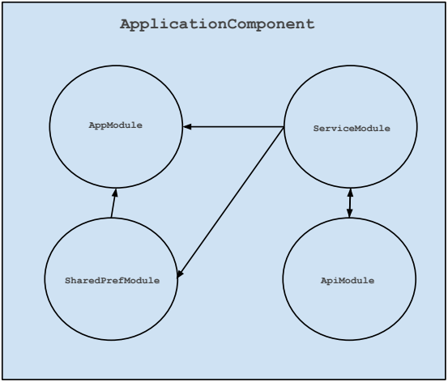

# 2. Android - How simply integrate Dagger2 in your app

In previous project [RetrofitMockServer](https://github.com/ciriti/RetrofitMockServer) you've seen how use Retrofit to create a mock server for your app, now we'll work to improve it. 

The purpose of this article is to show you how add and use [Dagger2](http://google.github.io/dagger/) to create a flexible and manutenible architecture, 
furthermore I'll show you how to display data putting them in a RecyclerView and a smart way to restart your app ( taken by [Jake Wharton's project](https://github.com/JakeWharton). )

This project will be the start point for the next article which will show you how to integrate RxJava for android and how to use it. 

Let's start!

##Dagger 2

###Overview

Dagger 2 is one of the best library ever created. It was built by Square and it is based on the [Dependency injection pattern](https://en.wikipedia.org/wiki/Dependency_injection).

The purpose of this library is to create a Directed Acyclic object Graph (DAGger), at runtime, with the instances of your android application during the startup, this graph will be use to get objects inserted to use them across your app.

In this way you can think to your app like a set of component who are built by other little specialized parts (the modules).

###Setup

In your gradle file add you should add the following lines:
```gradle
apply plugin: 'com.neenbedankt.android-apt'

buildscript {
    repositories {
        jcenter()

    }
    dependencies {
        classpath 'com.neenbedankt.gradle.plugins:android-apt:1.4'
    }
}
repositories {
    maven { url "https://oss.sonatype.org/content/repositories/snapshots" }
}

...

dependencies {
   ...
    //Dagger
    compile 'com.google.dagger:dagger:2.0.1'
    compile 'com.google.dagger:dagger-compiler:2.0.1'
    provided 'javax.annotation:jsr250-api:1.0'
    ...
}

```
First line is the plugin who assists in working with annotation processors in combination with Android Studio.
Then we have to add the dependencies about dagger (library, compiler and supplementary annotations).

### Implementation

What we're creating is a component which contains few modules, in this sample we don't care about the Scope, we'll talk about it in the next article.

```java
@Singleton
@Component(modules = {
        AppModule.class,
        SharedPrefModule.class,
        ServiceModule.class
}
)
public interface ApplicationComponent {
    void inject(FragUsers fragUsers);
}

```
A component is an interface annotated with @Component keyword; the method inject(...) tell to app where inject the component.

Following the modules:

* AppModule
```java
@Module
@Singleton
public class AppModule {
    App app;
    public AppModule(App app) {
        this.app = app;
    }
    @Provides
    @Singleton
    public App provideApplication(){
        return  app;
    }
}
```
* SharedPrefModule
```java
@Module
@Singleton
public class SharedPrefModule {
    public static final String SHARED_P_NAME = "damr";
    @Provides
    public SharedPreferences providePreferences(App app){
        return app.getSharedPreferences(SHARED_P_NAME, Context.MODE_PRIVATE);
    }
}
```
* ServiceModule
```java
public class ServiceModule {

    ...

    @Provides
    Endpoint provideEndpoint(){
        return Endpoints.newFixedEndpoint(URL_ENDPOINT);
    }

    @Singleton
    @Provides
    public ApiService provideStackExchangeService(RestAdapter restAdapter, SharedPreferences sharedPreferences, MockRestAdapter mockRestAdapter){
        if(sharedPreferences.getBoolean(HAS_MOCK, false)){
            return mockRestAdapter.create(ApiService.class, new MockService());
        }
        return restAdapter.create(ApiService.class);
    }

    @Provides
    MockRestAdapter provideMockRestAdapter(RestAdapter restAdapter){
        return MockRestAdapter.from(restAdapter);
    }

}
```
The ServiceModule will be different in live version, please take a glance to live ServiceModule.

* ApiModule
```java
@Module
@Singleton
public class ApiModule {

    ...

    @Singleton
    @Provides
    public RestAdapter provideRestAdapter(OkHttpClient okHttpClient, Endpoint endpoint){
        return new RestAdapter.Builder()
                .setClient(new OkClient(okHttpClient))
                .setEndpoint(endpoint)
                .build();
    }
    @Singleton
    @Provides
    OkHttpClient provideClient(App app){
        ...
        return client;
    }

}
```

This is how it appears



The @Module and @Provide annotation are used to provide dependences.

### Setup

It's time to run! First of all we have to extends the application class of your app and the instantiate our component

```java
public class App extends Application {
    ...
    @Override
    public void onCreate() {
        super.onCreate();
        apiComponent = DaggerApplicationComponent.builder()
                .appModule(new AppModule(this))
                .build();
    }
    ...
}
```

Now we can get our instance of service where previously we've declared the injection (FragUsers fragUsers)

```java
    @Inject
    ApiService apiService;
```

To get more details please take a look to the source code. 

See you next article!!
